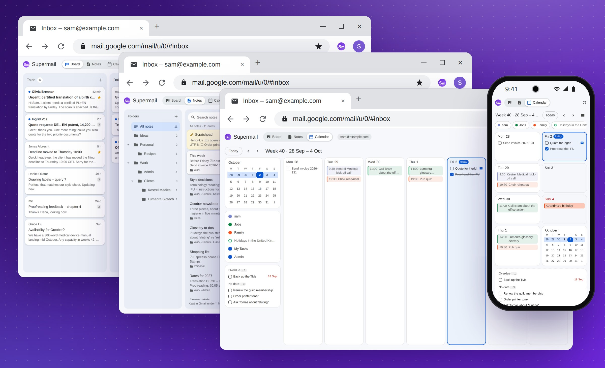

# MemDesk help

MemDesk puts a Kanban board, a notebook and your calendar inside Gmail.
Every card on the board is an email. Every note is a message in your own
mailbox. Your Google Calendar and Google Tasks are there too, and you can
change them without leaving Gmail.

There is no MemDesk server and no account to make. Everything lives in your
own Google account, as labels, messages, events and tasks.

It runs in Chrome on a computer. On an Android phone, a home-screen app
has the board, the notes and the calendar, and a small panel in the Gmail
app puts the email you are reading on the board. It works with Google
Workspace accounts and with ordinary @gmail.com accounts.

Want to see it first? The [demo](https://memdesk.app/demo/) is MemDesk in a
made-up Gmail, on a computer and on a phone, with nothing to install.

## Contents

- [Getting started](getting-started.md): install it, connect Gmail, and
  find the buttons.
- [The board](board.md): columns and cards, moving them, editing a card,
  and what Done does.
- [Notes](notes.md): notes and folders, the editor, search and the
  Scratchpad.
- [Calendar](calendar.md): your week, events and tasks, and changing them.
- [The phone app](phone-app.md): the board, the notes and the calendar on
  your phone.
- [The Gmail panel](gmail-panel.md): put an email on the board from the
  Gmail app.
- [Privacy and safety](privacy.md): what MemDesk never does, and where your
  data is kept.
- [Licence](licence.md): the free preview, and what the licence allows.
- [Questions and troubleshooting](questions.md): what to do when something
  is not right.
