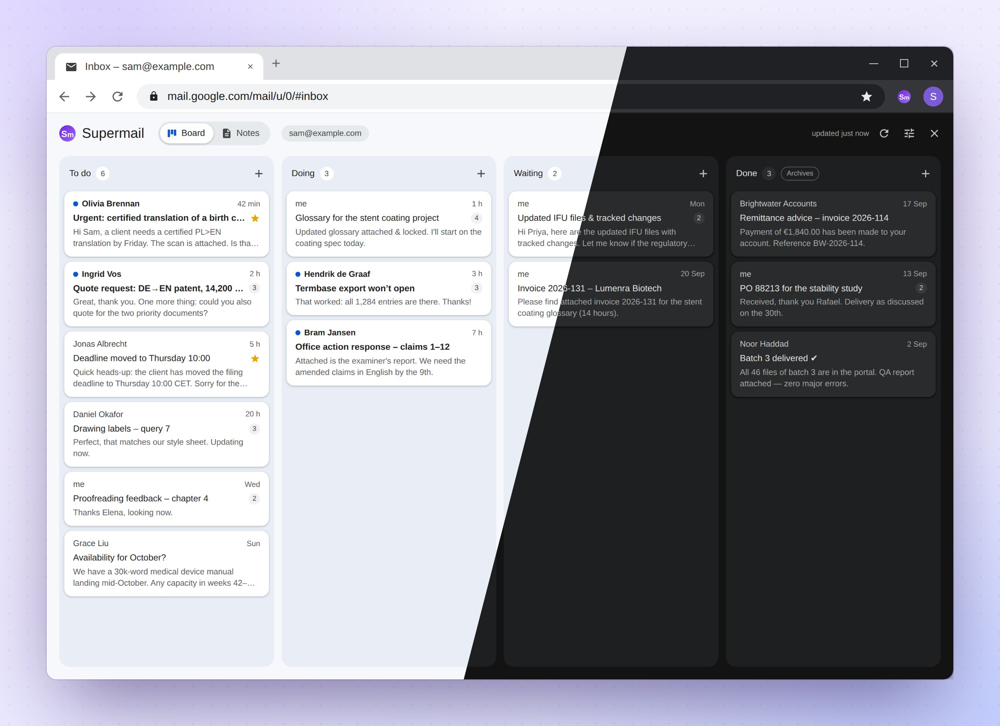

# The board

The board shows your email as cards in columns. Each column is a Gmail
label, and each card is a conversation with that label. When you move a
card, its label moves with it. Open the board with the **Board** button in
Gmail's top bar.

## Columns and cards

You start with four columns: **To do**, **Doing**, **Waiting** and
**Done**. In Gmail they are the labels `_Board/To do`, `_Board/Doing` and
so on, so you see them in Gmail's list of labels, on your phone too.

Each card shows:

- the subject, or your own title for it;
- who sent the latest message ("me" if it was you), and how long ago;
- two lines of the latest message;
- how many messages the conversation has;
- a star if it is starred, and bold text with a dot if it is unread.

**Click a card** to open the email in Gmail. Ctrl-click or middle-click
opens it in a new tab.

Each column shows up to 100 cards, and says so when there are more. The
board brings itself up to date when you open it, if what it shows is more
than a minute old. The **refresh** button at the top right does it at once.

## Moving cards

**Drag** a card to another column, or up or down within a column to change
the order. A placeholder shows where it will land.

## The card menu

Each card has a **⋯** button. Its menu does everything without a mouse:

- **Open in Gmail**.
- **Edit card…**: your own title, note and colour (see below).
- **Move up** and **Move down** within the column.
- **Move to** another column.
- **Remove from board** takes the card off the board. The email itself
  stays in Gmail, where it was.

## Adding emails

The **+** at the top of a column opens a search box. It understands Gmail's
own search words, such as `from:anna is:unread`. Leave it empty to list your
Inbox. Click a result to add it to that column.

## Filing the email you are reading

While you read an email in Gmail, a button appears next to **Board**:
**Add to board**, or **On board: Doing** if the email is already on the
board. Its menu puts the email in a column, moves it to another one, or
takes it off the board, without opening the board.

## Editing a card

**Edit card…** in the card's menu gives a card your own title, a note and a
colour:

- the title replaces the subject on the board;
- the note replaces the two lines of the email;
- the colour shows as a stripe down the card's left edge.

None of this changes the email. The subject, the labels and what the people
you write to see stay exactly as they were. Hover over a renamed card to see
the email's real subject.

To put a card back as it was, choose **Use the email subject**, empty the
note and choose **No colour**. In the editor, Enter saves from the title,
Ctrl+Enter saves from the note, and Esc cancels.

## Colours from your Gmail labels

Give a label a colour in Gmail: click the three dots beside it, then
**Label colour**. Every card whose conversation has that label then shows
the label's name as a small tag in that colour, with a stripe to match. A
Gmail filter that labels mail (everything from one client, say) colours
their cards too.

The board's own `_Board` labels and the notes' labels never count. If a
card has several coloured labels, the first two by name show, and the first
gives the stripe. A colour you set with **Edit card…** wins over them.

## Waiting on them

When the latest message in a conversation is yours, the ball is in the
other person's court. The card then says **Waiting on them**. It does not
say so if your message was only to yourself, or while you have a reply in
draft, and it never shows in Waiting or Done.

Click **Waiting on them** to move the card to the top of **Waiting** (or of
whichever column has "wait" in its name). Nothing moves by itself.

## Done

Moving a card to **Done** also archives the email: it leaves your Inbox,
but keeps its label, so you can still find it.

Done also plays a short, soft chime of two notes when a card lands there:
whether you drag it, use the card menu, add it from a search or use the
button in Gmail's top bar. Changing the order of the cards within Done is
quiet.

You can switch archiving and the chime on or off for any column, in the
column settings.

## Column settings

The **column settings** button at the top right of the board opens the
**Columns** panel. There you can:

- add a column with **+ Add column**. Its label is made in Gmail when you
  save;
- change a column's title, and its Gmail label. Changing the label here
  renames it in Gmail itself, so the mail filed under it stays put;
- change the order with the arrows: up is further left on the board;
- remove a column with its ✕. That only takes it off the board: the Gmail
  label, and the mail in it, are left untouched;
- tick **Archive threads moved here** to make a column archive, as Done
  does;
- tick **Play a short chime when a card is moved here**. Ticking it plays
  the chime, so you hear what it sounds like.

Click **Save** when you are done. If you rename a board label in Gmail
itself, the board follows it, rather than making a new, empty one.

## On other computers

Your columns and your card edits follow your Chrome profile to your other
computers. The order of the cards within each column is kept on each
computer.

## Columns on your phone

**The phone app keeps a layout of its own.** For now, the extension in
Chrome and the phone app each keep their own columns and card edits: a
column you add, rename or remove in one does not show in the other. The
cards themselves are the same everywhere, because they are your Gmail
labels.
