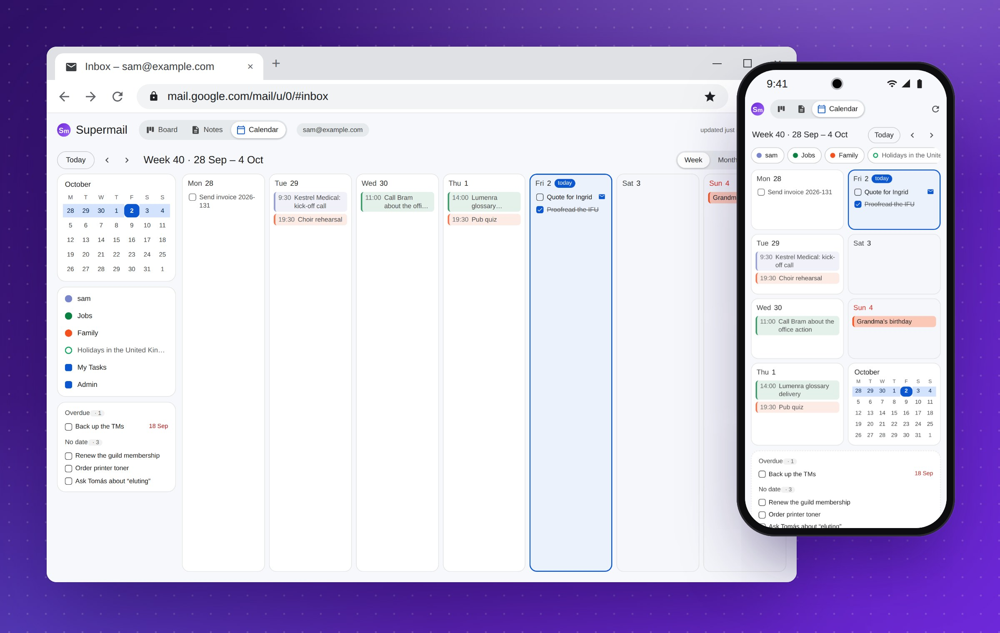

# Calendar

The **Calendar** tab is your Google Calendar with Google Tasks woven into
it. You can change it too: what you change goes straight to Google Calendar
and Google Tasks. Open it with the **Calendar** button in Gmail's top bar.

## Connecting it

The first time you open the calendar, it asks to connect. Click **Connect
Google Calendar** and allow it on Google's page. It asks to see your list
of calendars, to change their events and your tasks, and for your email
address, to check that the calendar is the one of the account open in
Gmail. It cannot change a calendar itself, or who it is shared with.

This is a permission of its own. The board and the notes never need it,
and keep working whatever you answer.

## Week, month and agenda

The buttons **Week**, **Month** and **Agenda** are at the top right.

- **Week** is by the hour, as in Google Calendar, on the 24-hour clock.
  Each day's all-day events and tasks are along its top, and a red line
  shows the time now.
- **Month** shows a few things a day, and "+2 more". Click a day's number
  to see its week.
- **Agenda** is the next four weeks as one list, without the empty days.

Move about with **Today**, **‹** and **›**, or with the keys Google
Calendar uses: **t** for today, **j** or **n** for next, **k** or **p** for
previous, and **w**, **m** and **a** for the views. Click a day in the small
month on the left to go to it.

On each day come the all-day events first, then the rest by time, then the
tasks due that day.

## Your week, your way

- **The day, not the night.** The week shows 07:00 to 22:00, filling the
  window. Something earlier or later widens the hours to fit it, so nothing
  is ever hidden. The moon button shows all 24 hours, with the night shaded.
- **A second time zone.** The corner above the hours names yours, such as
  "GMT+2". Click it to add a second time zone, whose hours show beside
  yours: New York, say, or London. Click it again to change it or take it
  away.
- **Two rows.** The button just left of **Week** shows the week as two
  rows, Monday to Thursday above Friday to Sunday, without the hours. That
  gives each day more room.
- **Calendars and task lists.** Those on the left show or hide with a
  click. Until you click, they are as Google Calendar has them.

This computer remembers what you chose.

## The Scratchpad in the week

When the week is in two rows, the space beside Sunday holds your
**Scratchpad**: the same note as in Notes, to type into right there. It
saves as you type, or with Ctrl+S, and takes the same keys as a note,
without the toolbar.

## Changing an event

Click an event. A small editor opens: the title, all day or from when until
when, how it repeats, and where. **Save** sends it to Google Calendar.
Ctrl-click (or middle-click) opens an event in Google Calendar instead.

You can also drag:

- **Drag an event** to another day or time. Dropped on a day's name, it
  keeps its times. Dropped in the hours, it starts where you let go, to the
  quarter hour, and keeps its length. A dashed box shows where it will go.
- **Drag the bottom edge** of an event up or down to change when it ends.

Some events MemDesk may not change, so they open in Google Calendar
instead: those on a calendar shared with you to read only (holidays, say),
birthdays, and meetings someone else organises without letting guests
change them.

## Adding events and tasks

- **The +** on a day adds to it. Type "Dentist 14:30" and it is an event at
  that time, an hour long ("9:15-10:00" gives both times). Type "Pay the
  invoice", with no time, and it is a task due that day. Or choose
  **Event** or **Task** yourself.
- **Click an empty half hour** in the week. The editor opens on a new event
  there, an hour long: type its title and press Enter.

A new event goes in your main calendar, unless you pick another one.

## Tasks

Tick a task off with its box, and tick it again to undo that. Click its
title to change the title or the day, or to give it no day at all. Drag a
task to another day, or onto the tasks with no date to take its day away.

Tasks with no date, and open tasks whose day has gone by, are listed on the
left, under the calendars. A task made from an email has a small envelope:
Ctrl-click it to open that email.

## Repeating events

**Repeats**, in the editor, is Google's own menu: daily, weekly on the day,
monthly on its weekday, annually or every weekday. **Custom…** gives every
so many days, weeks, months or years, on the weekdays you pick, ending
never, on a date or after so many times.

When you save or delete one event of a series, MemDesk asks whether you
mean **This event** or **All events**. Dragging one event of a series, or
making it longer, changes that event only, as in Google Calendar. A repeat
made in Google Calendar that MemDesk cannot show is kept as it is, unless
you choose another.

## Deleting, with Undo

**Delete** is in the editor. It asks first, naming the event and its
calendar. Then the event goes from the screen, with an **Undo** for eight
seconds. Only after that is Google asked to delete it: close the tab in
those seconds and nothing is deleted at all.

Stopping a series repeating takes its other events away, so it waits out
the same Undo.

## Nothing is overwritten

If an event was changed in Google Calendar while you had it open (on your
phone, or by a colleague), your change is refused. MemDesk says so and
shows you the latest version instead. The same goes for deleting.

## In a narrow window

In a narrow window, as on a phone, the calendar shows the week as two
columns of days, with the month as the eighth tile. See
[The phone app](phone-app.md#the-calendar).
