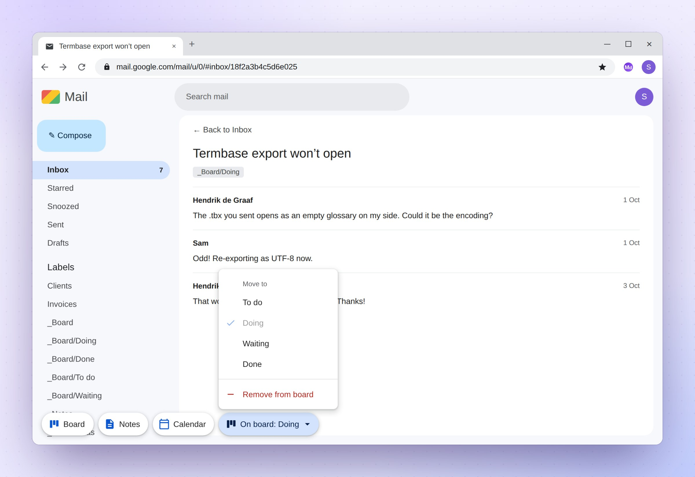

# Getting started

MemDesk is not in the Chrome Web Store for everyone yet. There are two ways
to get it: from a link you were sent, or by setting up a copy of your own.

## If you were sent a link

This takes about two minutes. You need Chrome and your Google account.

1. Open the Chrome Web Store link you were sent, in Chrome, and click
   **Add to Chrome**, then **Add extension**.
2. A MemDesk page opens. Click **Connect Gmail** and choose your Google
   account.
3. Google may say **Google hasn't verified this app**. That is because
   Google has not reviewed MemDesk yet, not because something is wrong.
   Click **Advanced**, then **Go to MemDesk**.
4. Google lists what MemDesk may do with your Gmail and asks you to allow
   it. The list is broader than what MemDesk does: it never sends mail and
   never deletes mail for good. Click **Continue**.
5. The page says **Connected as** and your address. You are ready.

For your phone, see [The phone app](phone-app.md).

## If you set it up yourself

You can also set up a copy of your own from the code on GitHub. It takes
about 15 minutes, once: you load the extension into Chrome and make a free
Google Cloud project, so that the extension can talk to your Gmail. The
phone panel and the phone app take another few minutes each.

The step-by-step guide is [SETUP.md](../SETUP.md). It explains every screen,
and what to do if Google says no.

## Where the buttons are

Open Gmail, or reload it if it was already open. Three buttons sit in
Gmail's top bar, beside the search box: **Board**, **Notes** and
**Calendar**. In a narrow window they show only their icons, and in a very
narrow one they float at the bottom left.

There are two more ways to open MemDesk: click its icon in Chrome's
toolbar, or press **Alt+Shift+K**. You can change that shortcut at
`chrome://extensions/shortcuts`. Press **Esc** to close MemDesk again.

While you read an email, a fourth button appears: **Add to board**, or
**On board: Doing** if the email is already on the board. Its menu files the
email in a column without opening the board. See
[The board](board.md#filing-the-email-you-are-reading).

You can move the buttons to a bottom corner of Gmail, or hide them, on
MemDesk's setup page: right-click its icon in Chrome's toolbar and choose
**Options**.

## The first time

The first time you open the board, MemDesk makes its four columns as Gmail
labels: `_Board/To do`, `_Board/Doing`, `_Board/Waiting` and
`_Board/Done`. The underscore puts them at the top of Gmail's list of
labels. The notes keep themselves under a label called `_Notes`.

The first time you open the calendar, it asks to connect. Click **Connect
Google Calendar** and allow it on Google's page. This is a permission of its
own: the board and the notes keep working whatever you answer.

## Finding your way round

Across the top of MemDesk:

- **The MemDesk logo** opens a small menu: the version you have, the
  website, the privacy page and the licence.
- **Board**, **Notes** and **Calendar** switch between the three. MemDesk
  opens on the one you used last.
- **Your Gmail address** shows which account you are in.
- On the right: when it was last updated, the **refresh** button, the
  **column settings** button (on the board only) and **close**.

MemDesk is light or dark, as Chrome is.
