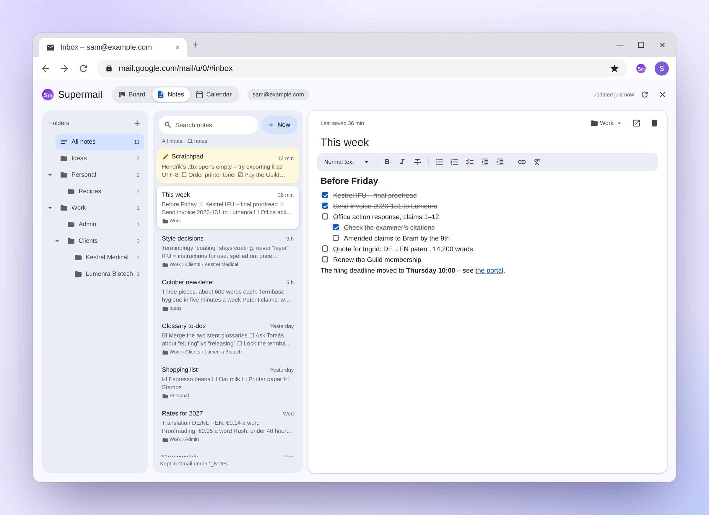
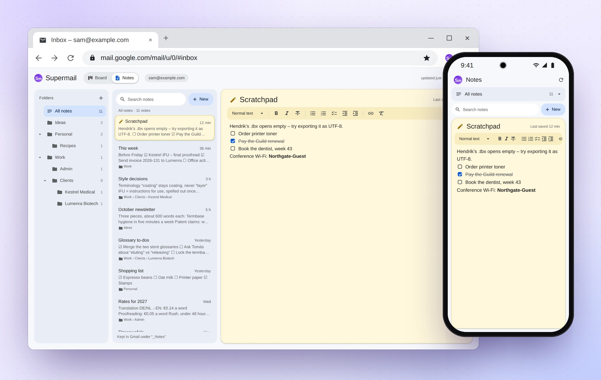
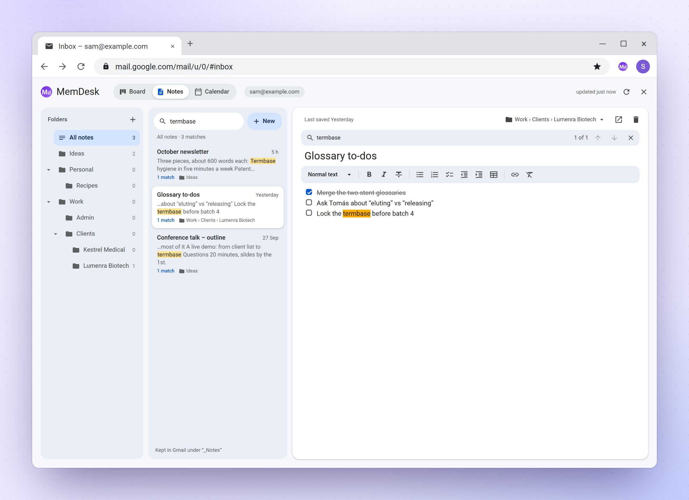

# Notes

Your notes live in Gmail, as messages in your own mailbox under the label
`_Notes`. They are never sent, and never show in your Inbox. Open them with
the **Notes** button in Gmail's top bar, or the **Notes** tab at the top of
MemDesk.

The folders are on the left, the list of notes in the middle (newest
first), and the open note on the right.

## The Scratchpad

The Scratchpad is one note that is always at hand. The notes open on it,
with the cursor in it, so you can start typing at once. It is pinned at the
top of the list, and open whenever no other note is.

It is the same note on every computer and phone, so a line typed on the
phone is waiting in Chrome. It has no folder and cannot be renamed or
deleted: to clear it, delete its text. It is also in the
[calendar's week](calendar.md#the-scratchpad-in-the-week), when you show
the week in two rows.

## Writing and saving

Click **New** to start a note. It starts in the folder you are looking at.
A note has a title and the text; Enter in the title moves to the text. A
note with no title is filed under its first line.

A note **saves itself** a couple of seconds after you stop typing, and
again when you switch notes or tabs or close MemDesk. **Ctrl+S** saves at
once. The line above the title says "Unsaved changes", "Saving…" or
"Saved". If you close the Gmail tab with a change not yet saved, Chrome
asks before leaving.

If the same note is changed on another computer or phone while you edit
it, nothing is lost: the newer version comes in with your changes on top,
and a paragraph changed on both sides is kept in both versions.

## Formatting

The toolbar above the text has a text style menu (normal text and three
sizes of heading), bold, italic, strike-through, bulleted, numbered and
check lists, less and more indent, a table, a link, and clear formatting.

Keyboard shortcuts:

- **Ctrl+B** bold, **Ctrl+I** italic, **Ctrl+K** a link.
- **Ctrl+Shift+7**, **8** and **9**: a numbered, bulleted or check list.
- **Tab** and **Shift+Tab** indent a list item, up to three levels.
- **Ctrl+Enter** ticks a check box. So does clicking it.

Or type at the start of a line, then a space: `-` for a bulleted list,
`1.` for a numbered one, `[]` or `[x]` for a check list, and `#`, `##` or
`###` for a heading. Enter on an empty list item ends the list. Backspace
at the start of a list item or heading turns it back into plain text.
Ctrl-click a link to open it.

## Contents

For a long note with headings, the **Contents** button at the right end of
the toolbar lists the headings beside the text, indented by level. Click
one to go to it; the cursor goes there too. As you scroll, the heading of
the part you are reading is marked. The list follows as you add, change or
remove headings.

Click **Contents** again to hide it. MemDesk remembers whether it is shown
on this computer. It needs room beside the text, so a narrow window or a
phone does not offer it.

## Tables

The table button puts a table where the cursor is: three columns, a heading
row and two more rows. **Tab** moves to the next cell (in the last cell it
adds a row), and **Shift+Tab** goes back. Enter starts a new line inside a
cell.

While the cursor is in a table, the **table bar** under the toolbar adds
and deletes rows and columns, turns the heading row on or off, aligns a
column, sorts the rows by a column, and deletes the table. **Ctrl+Z**
straight after one of these takes it back.

A wide table scrolls sideways, which is how it fits on a phone.

## Pasting

A paste keeps the formatting a note can hold. From Word, Google Docs, a web
page or an email, headings, bold, italic, strike-through, links and lists
come across; fonts, colours, sizes and images do not. Tables from Excel,
Google Sheets, Word or a web page arrive as tables. Cells copied from a
spreadsheet and pasted into a table fill it from that cell on.

Text written in Markdown, such as an answer copied from a chat assistant,
becomes formatting too: bold, italics, headings, lists, links and tables.

- **Ctrl+Shift+V** pastes the text alone, exactly as copied.
- **Ctrl+Z** straight after a paste takes it back.

## Folders

On the left are **All notes**, then your folders as a tree, each with how
many notes it holds. Click a folder to see only its notes, and to search
only inside it.

- The **+** at the top makes a folder.
- A folder's **⋯** menu renames it (its subfolders come along), makes a
  subfolder, or deletes it. Only an empty folder can be deleted.
- To move a note, drag it onto a folder (onto **All notes** to take it out
  of its folder), or use the folder button above the note.
- The small arrow beside a folder folds its subfolders away. Handy once the
  tree grows long.

Each folder is a Gmail label under `_Notes`, such as `_Notes/Work/Clients`,
so the same tree shows in Gmail's list of labels.

## Searching

Type in the search box above the list. Gmail does the finding, so it finds
words anywhere in a note, and Gmail's search words work too, such as
`before:2026/09/01`.

Each result shows short bits of the note around the words you searched for,
with the words highlighted, and how many matches it has. Capitals and
accents do not matter ("cafe" finds "Café"), a word also finds longer words
it starts ("gloss" finds "glossary"), and "words in quotes" are found as a
phrase.

Open a result, and every match in the note is highlighted. A bar above the
title says "2 of 5": its arrows, **F3** and **Shift+F3** step from one
match to the next. The ✕ on that bar clears the search.

## Deleting, and old versions

The bin button above a note moves it to Gmail's Trash, with an **Undo**.
The button beside it opens the note in Gmail, as Gmail keeps it.

Each time a note is saved, its previous version goes to Gmail's Trash,
where Gmail keeps it for 30 days. So Gmail's Trash is a history of your
notes: to get old text back, open an old version there and copy it.

## Emails among your notes

Anything else filed under `_Notes` shows in the list too: an email you sent
yourself from your phone, say. It is marked "From an email". If you edit
it, MemDesk saves a new note in its place and takes the `_Notes` label off
the email, which stays in Gmail. Deleting it does the same.
