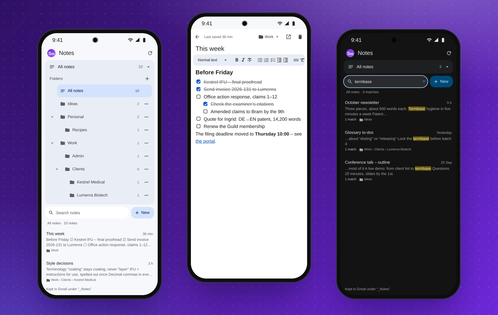

# The phone app

The phone app puts the board, the notes and the calendar on your phone's
home screen. They are the same board, notes and calendar as in Chrome, laid
out for a phone, and they work straight from your Gmail and Google
Calendar.

## Setting it up

If you were sent a link to the phone app:

1. Open the link in **Chrome** on your phone, signed in to the same Google
   account as your Gmail.
2. Google asks you to allow access, as on the computer. If it says it
   hasn't verified the app, tap **Advanced**, then **Go to …**.
3. Your Scratchpad opens. To put the app on your home screen, tap **⋮**,
   then **Add to Home screen**, then **Add**.

If you set up MemDesk yourself, the phone app runs from the same Apps
Script project as [the Gmail panel](gmail-panel.md), so you make the panel
first. The app is then one more step of about three minutes:
[SETUP.md, part 3](../SETUP.md#part-3-the-phone-app). Its address ends in
`/dev`, and only you can open it.

## The notes

The app opens on your Scratchpad, ready to type, under the search box and
**New**. It opens on the phone's own copy of the Scratchpad, so you can
start typing before Gmail has even answered. If it was changed on your
computer in the meantime, both changes are kept.

- **Folders.** The button above the search box says which folder you are
  in ("All notes"). Tap it and the folder tree opens, with each folder's
  **⋯** menu. Pick a folder and its notes take the Scratchpad's place. So
  does a search.
- **A note** opens full-screen when you tap it, with the same editor as in
  Chrome.
- **Back.** Android's back gesture, or the arrow at the top left of a note,
  goes from a note to its list, and from the list to the Scratchpad.
- **Saving.** A note saves a moment after you stop typing, and at once when
  you go back to the list or switch to another app.
- **Search** marks the words you searched for, in the results and in the
  open note, with arrows to step from one to the next.

See [Notes](notes.md) for the editor, folders and search.

## The board

One column fills the screen: swipe sideways for the next. A card's **⋯**
opens it in Gmail, moves it to another column, edits its title, note and
colour, or takes it off the board. The **+** on a column finds an email and
adds it, and the settings button changes the columns.

How the app's columns relate to the ones in Chrome:
see [Columns on your phone](board.md#columns-on-your-phone).

## The calendar

The week is two columns of days, Monday to Thursday and then Friday to
Sunday, with the month as the eighth tile. Swipe sideways for the next or
previous week.

- Tap a chip at the top to show or hide a calendar or task list.
- The button beside **›** changes which way the days run: down, then
  across, or across, then down.
- Tap an event or a task to change it, a task's box to tick it off, and the
  **+** on a day to add something. Dragging is for a computer: on a phone,
  change the day in the editor.
- The button at the end of the header (or the month's name in the eighth
  tile) shows the whole month, with a coloured line for each of the first
  few things on each day. Tap a day for its week, and swipe for the next or
  previous month.

The phone remembers what you chose. The calendar uses the app's own access
to Google, so there is nothing to connect. The first time, it may ask you
to **Allow** it: tap the button and allow it on Google's page.

## On a computer

Opened on a computer, the app is the board, the notes and the calendar as
in Gmail, in a browser tab of their own.
